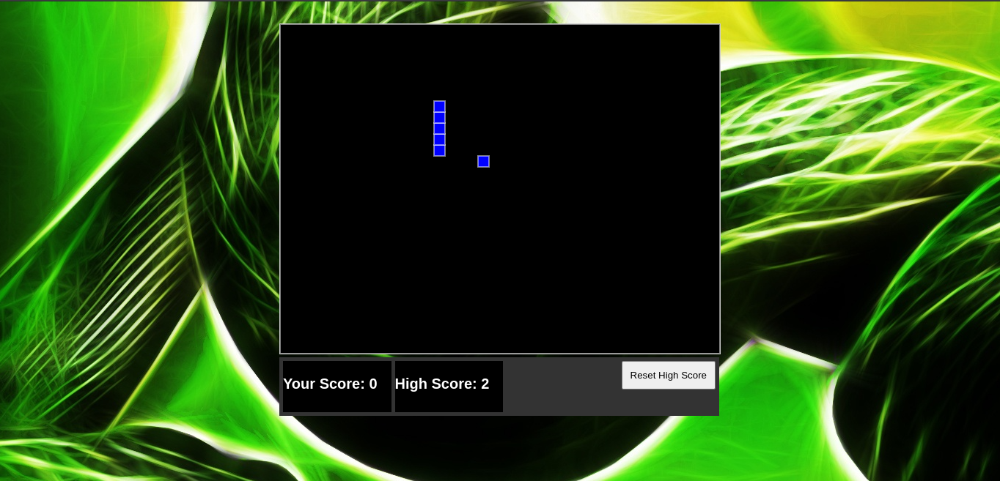

# Snake-Game-JS
A classic Snake Game built using HTML, CSS, and JavaScript. Open index.html in your browser to start playing — no installs or dependencies needed!

## How to Play
1. Use the arrow keys to control the snake's direction.
2. Eat the food (red square) to grow the snake.
3. Avoid running into the walls or yourself.
4. The game ends when the snake collides with a wall or itself.
5. The score is displayed at the bottom left corner.
6. High scores are saved in local storage and displayed at the bottom center.
7. The game resets when you refresh the page.

## Screenshots

*Watch the snake grow as you eat the food!*
